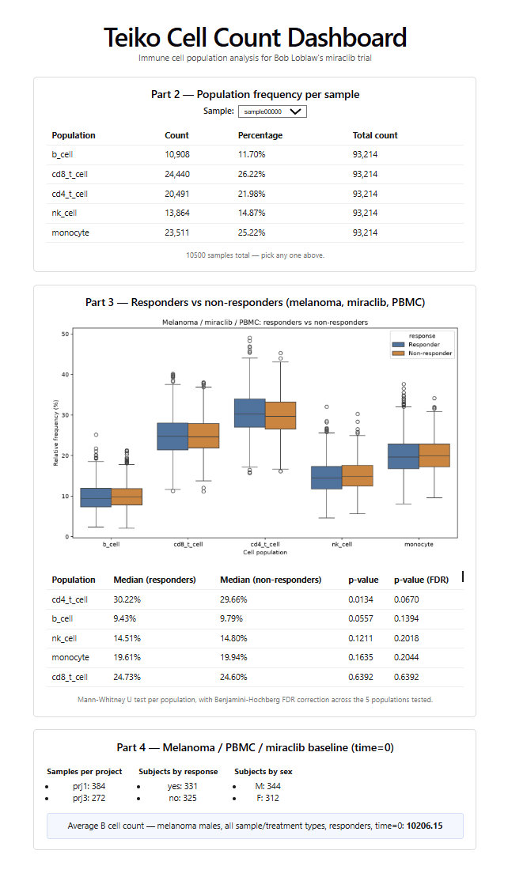

# Teiko Cell Count Dashboard

Analysis of immune cell population data for Bob Loblaw's miraclib trial. Loads `cell-count.csv` into SQLite, answers the four analysis questions, and shows the results in a small dashboard.



## Running it

```bash
make setup      # installs Python + frontend deps
make pipeline   # builds the db from data/cell-count.csv, writes results to outputs/
make dashboard  # builds the frontend and serves everything on :8000
```

In Codespaces just open the forwarded port 8000. `python load_data.py` and `python run_pipeline.py` also work standalone if you just want the database or just want the pipeline outputs without spinning up the dashboard.

`make pipeline` drops these into `outputs/`:
- `frequency_summary.csv` – per-sample, per-population frequency table (Part 2)
- `significance_tests.csv` – Mann-Whitney results, raw and FDR-adjusted (Part 3)
- `boxplot.png` – responders vs non-responders, per population (Part 3)
- `baseline_subset_summary.json` – baseline breakdown by project/response/sex (Part 4)
- `final_answer.txt` – the final number (Part 4)

### Dashboard

No separate hosted link right now — `make dashboard` starts it at `http://localhost:8000` (or the forwarded port in Codespaces).

## Database schema

```
projects(project_id)
subjects(subject_id, project_id, condition, age, sex, treatment, response)
samples(sample_id, subject_id, sample_type, time_from_treatment_start)
cell_counts(sample_id, population, count)
```

I split this into four tables instead of keeping the CSV's flat shape because the data actually has a hierarchy in it: a project has subjects, a subject gives multiple samples over time, and each sample has a count per population. Before I settled on `subjects` vs `samples` I actually checked the raw data — `condition`, `age`, `sex`, `treatment`, `response` never change across a subject's samples, only `sample_type` and `time_from_treatment_start` do. That's just how a trial works: one subject, one enrollment, one outcome, but several draws over time. So those fields live on `subjects`, not repeated on every row.

`cell_counts` is long (`sample_id, population, count`) rather than five separate columns. This was the one real scaling call in the schema — with wide columns, adding a 6th population means a migration; with long format it's just more rows, and every query already treats `population` as a value to filter/group on rather than a column name, so nothing changes as the panel grows.

**If this had to scale to hundreds of projects and thousands of samples:**

- The indexes I added cover the joins/filters this code actually does (`subjects.project_id`, `samples.subject_id`, `cell_counts.sample_id/population`). At real scale I'd tune indexes to whatever the actual hot queries turn out to be, and I'd probably move off SQLite to Postgres once more than one person needs to write to it at the same time — same four tables, different engine.
- Metadata is going to grow — trial arm, site, dosing on the subject side; batch, instrument, QC flags on the sample side. Those are just new columns until `subjects`/`samples` turn into a grab-bag, at which point I'd split out a table like `sample_qc`. If metadata varies a lot by site/instrument, an EAV table (`sample_attributes(sample_id, key, value)`) avoids schema changes altogether — same tradeoff as the long-format `cell_counts`.
- More analysis types probably means precomputed tables rather than schema changes — e.g. materializing `sample_frequencies` if recomputing percentages from raw counts on every request gets slow, refreshed by the pipeline instead of on each dashboard hit.

## Code structure

```
load_data.py       Part 1 — builds cell_counts.db, no args
run_pipeline.py     runs load_data + Part 2-4 analysis, writes outputs/
backend/
  schema.sql        the schema above
  analysis.py       Part 2-4 logic — takes a db connection, returns a dataframe/dict, no web stuff in here
  main.py           FastAPI app, one route per analysis function, serves the built frontend
frontend/           plain React + Vite, no TypeScript — one component per dashboard section
data/cell-count.csv the input data
outputs/            what make pipeline writes (gitignored)
```

The one thing I was deliberate about: `analysis.py` doesn't know FastAPI exists. Every function just takes a connection and hands back a dataframe or a dict. That's why `run_pipeline.py` (writing files to disk) and `main.py` (serving JSON) can both call the exact same functions instead of two versions of the same logic slowly drifting apart.

## Findings

Part 3 uses Mann-Whitney rather than a t-test since there's no reason to assume the frequency percentages are normally distributed. Testing all 5 populations means I should correct for multiple comparisons, so I ran Benjamini-Hochberg on top: `cd4_t_cell` looks significant on its own (p≈0.013) but doesn't hold up after correction (p≈0.067). So the honest answer for Bob is that cd4_t_cell is worth watching, not something to bring to Yah as a confirmed effect yet.

Part 4's answer — average B cell count for melanoma male responders at time 0, across all sample types and treatments — is **10206.15**.
